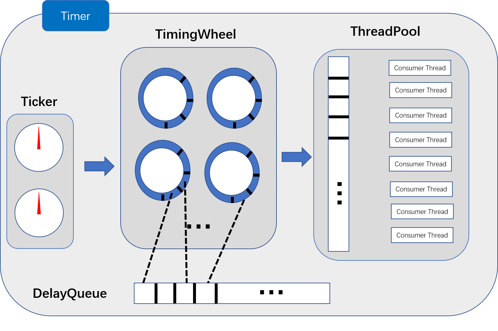
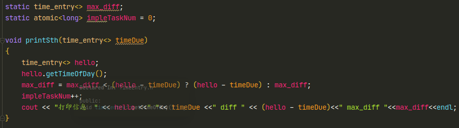
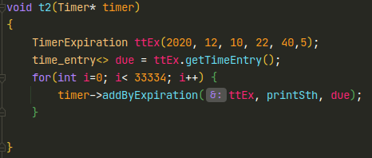
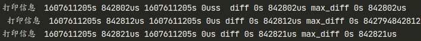
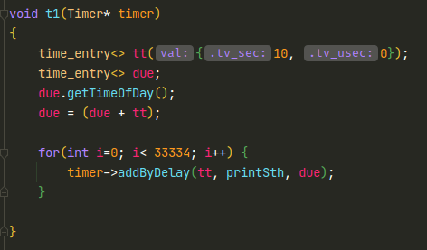
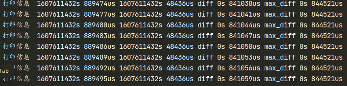

### 高并发时间轮定时器

#### １．环境依赖

* c++17
* 64bit linux

#### ２．特色

* 自定义time_entry<timeval>和TimerExpiration的变量类型，提供<b>微秒</b>级别的延时和定时任务。
* 支持带任意参数的定时函数，目前返回类型仅支持void。
* 定时任务并发量为10w/s，且延时控制在1s以内（840ms），支持秒级定时。
* 自定义DelayQueue, SpinLock, ThreadPool等组件，可单独拆分出来使用。

#### ３．组件说明

<div align = "center"><b>高并发时间轮定时器总体框图</b></div>



* Ticker

  内部时钟，由select模型构建，无监听描述符，超时返回推动时间轮TimingWheel前进。

* TimingWheel

  分级时间轮，后一级时间轮分片时间＝前一级时间轮分片时间×桶数目，定时任务超过当前时间轮表示最大时间时，会自动创建后一级时间轮。

* DelayQueue

  由大顶堆构建，通过offer加入延时任务，通过poll获取到期任务，利用自定义SpinLock可以同步poll和offer操作，减少mutex带来的线程切换开销。

* ThreadPool

  支持自定义线程池消费者线程数量，通过互斥锁＋条件变量控制线程之间同步，线程池关闭后，可确保阻止用户添加新任务，并完成任务队列剩余的任务才关闭线程池。

#### ４．接口说明

* ```c++
  Timer(time_entry<> tickMs, int wheelSize, int tickerNum = 2, time_entry<> timeout = time_entry<>({0,20000}), int threadNum = 8);
  ```

  Timer时间轮定时器的构造函数，tickMs表示第一级时间轮的分片时间；wheelSize表示每一级时间轮的桶数量；tickerNum是内部时钟个数，默认是２；timeout是内部时钟i/o复用模型select的超时时间，默认是20ms；threadNum是线程池消费者线程数量，默认是８。

* ```c++
  void start();
  ```

  用于启动时间轮定时器，定时器构建完成后，即可调用该函数启动它，之后定时器便可接受定时和延时任务。

* ```c++
  template<typename Func, typename ... Args>
  void addByDelay(time_entry<> delayTime, const Func& func, Args&& ... args)
  ```

  添加延时任务的接口，delayTIme是延迟时间，func是延时任务的函数指针，args...是可变参数的参数包。

* ```c++
  template<typename Func, typename ... Args>
  void addByExpiration(TimerExpiration& expiration, const Func& func, Args&& ... args)
  ```

  添加定时任务的接口，expiration是定时任务到期时间，func是定时任务的函数指针，rgs...是可变参数的参数包。

* ```c++
  void shutdown()
  ```

  用于关闭定时器，调用后，定时器内部所有组件都将停止工作，并将线程池任务队列剩余任务执行完成才退出该函数。注意，调用该函数后，一定要清理Timer实例，这样才能彻底释放定时器各组件占用的内存。

* ```c++
  template<typename T = timeval>
  struct time_entry {}
  ```

  time_entry<>结构体，基于timeval构建，包含对timeval运算符重载，支持任意time_entry<>变量获取当前系统时间，可用于延时任务的延时时间设置。

* ```c++
  struct TimerExpiration
  ```

  TimerExpiration结构体，用于对定时任务到期时间的设置，构造函数参数接收变长参数，变长参数形式按从大到小排列（如year-month-monthday-hour-minute-second-microsecond）。

#### ５．实验结果

* 实验测试的函数

  

  测试函数获取当前时间，与预约时间计算时间差。

* 定时任务结果

  

  定时任务测试函数，3个线程，每个线程添加33334个任务，共100002个任务。

  

  １s内定时10万个测试函数，通过打印信息可知延时在840ms左右

* 延时任务结果

  

  延时任务测试函数，3个线程，每个线程添加33334个任务，共100002个任务。

  

  １s内延时10万个测试函数，通过打印信息可知延时在840ms左右

  
